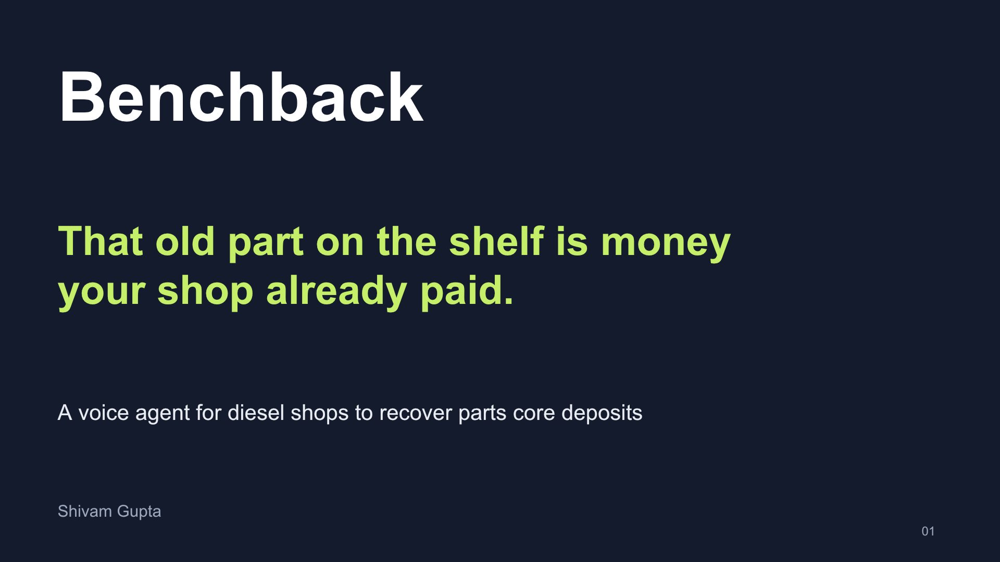

# Benchback

**From parts shelf to paid back.** A voice-operated core-deposit recovery desk for independent diesel repair shops.

Created by **Shivam Gupta** for the AssemblyAI Voice Agent Hackathon, September 2026.

When a shop buys a remanufactured alternator or starter, it often pays a refundable deposit on the old part—the *core*. Getting that money credited requires the right purchase match, the supplier’s return conditions, a physical return, and a credit memo. Benchback connects those steps.



## The demonstration

An old alternator represents a **$240 deposit**. Its original box is missing. Benchback asks for the exact part, invoice, job and purchase line; reads the configured supplier policy; and checks the approved alternative packaging. The technician corrects incomplete information in conversation. A person confirms the purchase and prepares the return.

Recording dispatch does **not** claim receipt or money recovered. A real $200 supplier credit leaves **$40 unresolved**. A second credit closes it, or an owner can explicitly accept a documented $40 deduction—reported separately from recovered credit.

The sample supplier, records and conversations are fictional. The public walkthrough is scripted and resets on refresh. Live AssemblyAI voice is a separate, clearly labelled mode in a signed-in workspace.

## What is implemented

- AssemblyAI Voice Agent API over one WebSocket: microphone → transcription → reasoning → scoped tools → spoken response. 24 kHz mono PCM, streaming resampling, interruption handling, final transcripts and cleanup.
- Sign in with ChatGPT; owner-scoped durable D1 records. The public example is a local demonstration; `/workspace` saves actual account records.
- Purchase and credit CSV imports with validation previews, exact identifiers, integer-cent amounts and transaction rollback.
- Versioned supplier-policy snapshots per purchase: dispatch or receipt deadlines, completeness, packaging, labels, authorization and credit follow-up.
- Human approval gates enforced by server code. Voice can record observations and follow-ups; it cannot approve returns, ship parts, post credits or waive conditions.
- Return packets as PDF, ledger CSV, complete workspace JSON and per-core evidence history.
- Receipt tracking, historical-return onboarding, audited date corrections, partial credits, reversible credit postings, accepted deductions and reopening.
- Optimistic concurrency, idempotency, unique supplier memo-line allocation, same-origin mutations, bounded voice sessions and quotas.
- Workspace export and deletion. Audio files are not retained by Benchback.

## Run locally

Requires Node.js 22.13+ and npm. No external database account is needed locally.

```sh
npm ci
npm run build
npm run db:migrate:local
npm run dev
```

Open the URL printed by the dev server (normally `http://127.0.0.1:5173`). Local sign-in uses a synthetic account, **Seedy**, and does not contact ChatGPT. Production authentication is supplied by the Sites dispatcher; never expose the application Worker directly while trusting client-supplied identity headers.

### Enable real voice

1. Activate an AssemblyAI account and get an API key from its dashboard.
2. Copy `.env.example` to `.env.local` and set `ASSEMBLYAI_API_KEY`. Do not commit it.
3. Restart the dev server. In production, configure the same name as a **server secret** through the hosting environment.
4. Sign in, add fictional practice records, select an undispatched core, consent to voice processing, and start a conversation.

The AssemblyAI account must have Voice Agent API access. STT trial credits do not guarantee that entitlement. The published Voice Agent API price was **$0.075/minute** when researched; recheck the [official price](https://www.assemblyai.com/pricing). A configured key badge only means a server secret exists, not that a live call has passed.

## Verify

```sh
npm test
npm run typecheck
npm run lint
npm run build
```

The automated suite covers business invariants, real isolated D1 transactions and the PCM worklet. It includes tenant isolation, concurrency, import rollback, memo allocation, reversals, date corrections, accepted deductions and voice permission boundaries. Provider audio quality and real microphone behavior require the separate [live acceptance procedure](docs/acceptance.md).

## Architecture and deployment

React 19 + TypeScript on Vinext/Cloudflare Workers; Cloudflare D1 stores owner-scoped records. AssemblyAI provides the native voice stack. jsPDF produces return packets in the browser. [Architecture and security](docs/architecture.md) · [Operations](docs/operations.md) · [Privacy](app/privacy/page.tsx).

This repository is bound to one OpenAI Sites project by `.openai/hosting.json`. Sites publishes the compiled Worker and applies committed D1 migrations. The current hosting audience is owner-private. A judge-facing link needs the owner to explicitly enable the intended audience. Do not treat a private deployment link as publicly accessible.

This is a working hackathon build with production-oriented safeguards, **not a validated commercial launch**. Live provider verification, customer discovery, noisy-workshop trials, support, backups/restore exercises and paid pilot results remain release gates. There is no carrier purchase, automatic supplier submission, ERP synchronization, payment collection or bank integration.

## Commercial hypothesis

Initial buyer: an independent diesel shop with dry alternator/starter cores and no reliable recovery process. Fullbay already tracks cores; Benchback’s proposed advantage is faster capture of missing information at the bench and less effort closing the credit loop. That advantage is unproven. The pilot compares voice with a short form and the shop’s current process, counting CSV/import work.

Proposed test price: **$99/location/month including 200 voice minutes** ($15 of provider voice cost at the researched rate). This is a pricing hypothesis, not a live offer or a profit forecast. Hosting, support, acquisition and other costs are additional. [Business and pilot plan](submission/03-business-and-pilot.md).

## Submission kit

- [Pitch deck (PowerPoint)](submission/benchback-pitch.pptx) · [PDF](submission/benchback-pitch.pdf)
- [Cover image](submission/benchback-cover.png)
- [Submission text](submission/01-submission-copy.md)
- [Verbatim video script and shot plan](submission/02-verbatim-video-script.md)
- [Judge FAQ and candid rubric review](submission/05-judge-faq-and-self-review.md)
- [Launch-validation checklist](submission/06-launch-validation-checklist.md)

The video still needs Shivam’s recording, and the final submission must include a working accessible application link. Do not present the scripted replay as a live provider call.

## License and attribution

MIT © 2026 Shivam Gupta. Third-party packages retain their licenses; the vendored Sites build integration includes its upstream MIT notice. AssemblyAI powers live voice. This project is not affiliated with any example supplier. For project questions, use this repository’s Issues; never put private records, API keys or personal customer information in a public issue.
