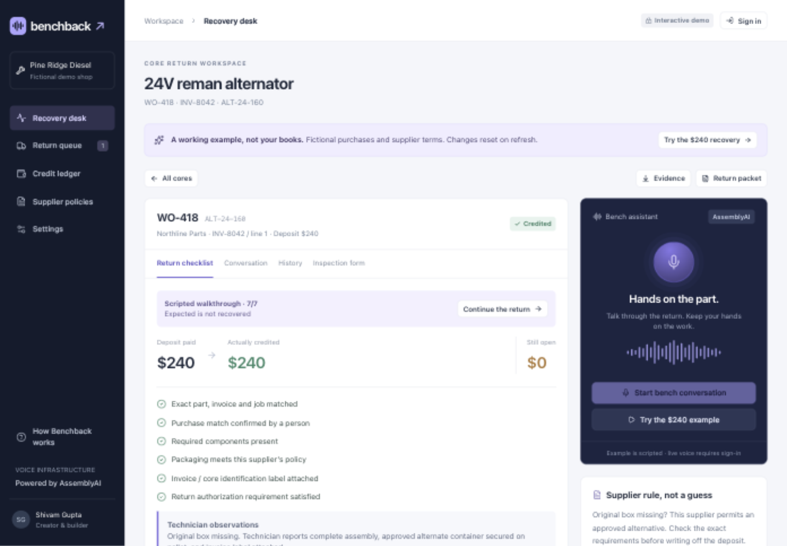

# Benchback

**From parts shelf to paid back.** A voice-operated core-deposit recovery desk for independent diesel repair shops.

Created by **Shivam Gupta**. Built with AssemblyAI's native Voice Agent API.

[Hackathon submission](https://lablab.ai/ai-hackathons/assemblyai-voice-agent-hackathon/benchback/benchback-from-parts-shelf-to-paid-back) · [Watch/download the demo](submission/benchback-demo.mp4) · [Open Benchback](https://benchback-ai.web.app) · [Public repository](https://github.com/shi1720/AssemblyAI) · [CI results](https://github.com/shi1720/AssemblyAI/actions)

When a shop buys a remanufactured alternator or starter, it often pays a refundable deposit on the old part, called the _core_. Getting that money credited requires the right purchase match, the supplier's return conditions, a physical return, and a credit memo. Benchback connects those steps.



## Try it

1. Open [Benchback](https://benchback-ai.web.app). **Try the $240 example** explores fictional records without signing in.
2. For saved records and live voice, open [Sign in](https://benchback-ai.web.app/signin) and choose **Try a private guest workspace**. No email is required. Email/password accounts are also available.
3. Select **Load practice purchases**. These fictional records belong to your workspace and persist after refresh.
4. Open the WO-418 alternator. Use the inspection form or start live voice after consenting to microphone processing.
5. Review the exact purchase identifiers, confirm the match yourself, and prepare the return. Record fictional dispatch and receipt evidence when testing. Import the demonstration credit CSVs to reconcile $200 and then the remaining $40.

Guest access stays in the browser. Create an email/password account from that guest session to keep the same workspace across devices. Do not enter real business records into a temporary guest account you cannot recover. Current verification evidence and remaining checks are in [the QA record](docs/qa-report.md).

## The demonstration

An old alternator represents a **$240 deposit**. Its original box is missing. Benchback asks for the exact part, invoice, job and purchase line, reads the configured supplier policy, and checks approved alternative packaging. A person confirms the purchase and prepares the return.

Recording dispatch does **not** claim receipt or money recovered. A $200 supplier credit leaves **$40 unresolved**. A second credit closes it, or an owner can explicitly accept a documented $40 deduction, reported separately from recovered credit.

Pine Ridge Diesel, Northline Parts, and their records are fictional. The public walkthrough is scripted and resets on refresh. Live AssemblyAI voice is a separate, clearly labelled mode in a signed-in workspace. The demonstration imports represent fictional supplier evidence, not an actual recovered payment.

## What is implemented

- AssemblyAI Voice Agent API over one WebSocket: microphone, transcription, reasoning, scoped tools and spoken responses. 24 kHz mono PCM, resampling, interruption handling, final transcripts and cleanup.
- Firebase Authentication with email/password and anonymous guest access. Server-verified sessions and durable, owner-scoped Firestore records.
- Purchase and credit CSV imports with validation previews, exact identifiers, integer-cent amounts and atomic transactions.
- Supplier-policy snapshots per purchase: dispatch or receipt deadlines, completeness, packaging, labels, authorization and credit follow-up.
- Human approval gates enforced by the server. Voice can record observations and follow-ups; it cannot approve returns, ship parts, post credits or waive conditions.
- Return packets as PDF, ledger CSV, full workspace JSON and per-core evidence history.
- Receipt tracking, historical-return onboarding, audited date corrections, partial credits, reversible postings, accepted deductions and reopening.
- Revision guards, idempotency, unique supplier memo-line allocation, trusted-origin checks, bounded sessions and voice quotas.
- Resumable workspace deletion. Benchback does not retain microphone audio files.

## Run locally

Requires Node.js 22.13+, npm and Java 21+ for the Firestore integration tests.

```sh
npm ci
npm test
npm run dev
```

Open `http://127.0.0.1:5173`. The public example works without credentials. Saved workspace development uses real Firebase Authentication and a Firestore connection, so configure a development project and the server environment described in [Operations](docs/operations.md). Local development does not create a synthetic signed-in user. Tests start their own isolated Firestore emulator and do not touch production data.

### Live voice

The deployed app reads `ASSEMBLYAI_API_KEY` from Google Secret Manager. A long-lived key is never sent to the browser. For local voice development, put that name in an ignored `.env.local` file and restart the dev server. The account must have native Voice Agent API access and available credit.

The published native Voice Agent API rate used in the planning model is **$0.075/minute**. Recheck the [official pricing](https://www.assemblyai.com/pricing) before budgeting. A configured-key indicator does not prove a completed voice conversation. [Live acceptance procedure](docs/acceptance.md).

## Verify and deploy

```sh
npm test
npm run typecheck
npm run lint
npm run build
npm run deploy
```

Run deployment only with authorized Google Cloud credentials and the provisioned project resources. The script builds a container, deploys Cloud Run, and publishes Firebase Hosting and Firestore rules. [Deployment details](docs/operations.md).

The verified local suite currently contains **92 tests**, including real Firestore emulator transactions, authentication boundaries, domain rules, PCM worklets and voice-client contracts. The public Firebase app has also been exercised with guest and email sign-in, saved returns, partial and final credit, refresh persistence, and 320px/390px layouts. The final hosted AssemblyAI run passed **11/11 checks** using synthetic technician speech, with two audit events and 21 transcripts persisted. The physical microphone conversation remains unverified; its permission-timeout and retry path were tested in Chrome. [QA record](docs/qa-report.md) · [Sanitized provider evidence](docs/live-voice-acceptance.json) · [Passing release CI](https://github.com/shi1720/AssemblyAI/actions/runs/35199621332).

## Architecture and operating limits

React 19 and Next.js 16 run on Node.js in Cloud Run. Firebase Hosting provides `benchback-ai.web.app`. Firebase Authentication verifies identity. The named Firestore database `benchback` stores records through server-only access. Google Secret Manager supplies the AssemblyAI key. jsPDF generates return packets in the browser. [Architecture](docs/architecture.md) · [Operations](docs/operations.md) · [Privacy](https://benchback-ai.web.app/privacy).

Cloud Run is configured with zero minimum and three maximum instances. The named Firestore database is billable and must not be described as free-tier storage. Hosting, builds, image storage, reads, writes and support also contribute to cost. This deployment has no customer SLA or billing system.

This is a working hackathon product with production-oriented safeguards, not a validated commercial launch. Customer discovery, noisy-workshop trials, backup restoration, support readiness and paid pilot results remain release gates. There is no carrier purchase, automatic supplier submission, ERP synchronization, payment collection or bank integration. Workspaces have one owner; shared shop roles are not implemented.

## Commercial hypothesis

The initial buyer is an independent diesel shop with dry alternator/starter cores and no reliable recovery process. Fullbay already tracks cores. Benchback's proposed advantage is faster capture of missing information at the bench and less effort closing the credit loop. That advantage is unproven. The pilot compares voice with a short form and the current process, including CSV preparation and corrections.

Proposed test price: **$99/location/month including 200 voice minutes**. At the planning rate, that is $15 of provider voice cost. This is a pricing hypothesis, not a live offer or profit forecast. All other costs remain additional. [Business and pilot plan](submission/03-business-and-pilot.md).

## Submission kit

- [Submission packet and delivery status](submission/README.md)
- [Pitch deck](submission/benchback-pitch.pptx) and [PDF](submission/benchback-pitch.pdf)
- [Cover image](submission/benchback-cover.png)
- [Submission text](submission/01-submission-copy.md)
- [Video script and shot plan](submission/02-verbatim-video-script.md)
- [Judge FAQ and provisional review](submission/05-judge-faq-and-self-review.md)

A scripted replay is not a live provider test. Video publication and event submission need their own verified delivery links. OpenAI speech generation is used only in offline presentation or synthetic audio preparation, not in the product's live voice stack.

## License and attribution

MIT © 2026 Shivam Gupta. Third-party packages retain their licenses. AssemblyAI powers live voice. Benchback is not affiliated with its fictional example suppliers. Use repository Issues for project questions; never post API keys, private records or customer information there.
