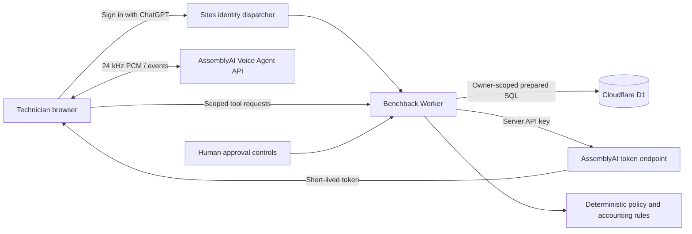

# Architecture and trust boundaries

The browser never receives the long-lived provider key. Tokens expire after 60 seconds and sessions are limited to 600 seconds. Application issuance limits are 8 tokens/account/day and 20 globally/day; a separate 30-attempt budget prevents upstream abuse. The browser stops at 595 seconds and cleans up microphone tracks, audio nodes and sockets.

## Data integrity

Each purchase snapshots its supplier policy. Changing policy definitions does not retroactively rewrite historical conditions. A purchase is unique within an owner by normalized supplier, invoice and purchase line/physical-unit reference. Record one unit per reference. Multi-unit invoice lines must be split into distinct physical-unit references during import.

Every mutation checks ownership. Observations include the line/unit reference; purchase confirmation requires exact normalized part, invoice, job and line. Normalization removes spaces and hyphens and changes case; it does not equate the letter O and digit 0. Ambiguous search candidates require clarification.

A state revision guards concurrent writes. D1 transaction batches combine state, audit events and memo allocation. Idempotency keys are checked against action fingerprints and core IDs. Reusing a key with a different action fails. A supplier/memo/line can be allocated once per owner while active; reversing the credit releases its allocation and retains the original credit and history.

Money is stored as integer cents. Expected deposit, posted credit, accepted deduction and unresolved balance remain distinct. A deduction closes only the unresolved amount and never inflates recovered credit. Reopen a deduction before editing credits. Supplier receipt starts the configured credit follow-up period. A dispatch date cannot establish compliance with a receipt-based deadline.

## Agent permissions

Voice tools may look up owner records, inspect the configured policy/readiness, record observations/inspection and add follow-up notes. A session is bound to one selected core for edits. Lookup may show other owner candidates, but switching the target requires starting another session. Only human API actions may confirm, prepare, dispatch, acknowledge receipt, post/reverse credits, correct return dates or accept/reopen deductions. These permissions are enforced by the server and pure state machine, not merely instructions to the LLM.

Tool and transcript requests originate in the browser. They are **client-reported**, not a cryptographic attestation of AssemblyAI activity or proof of a real-world inspection. Logs are evidence of recorded workflow changes, not independently verified supplier documents. There is no photograph, barcode authenticity or invoice ingestion guarantee.

## Authentication and hosting

Production trusts only identity headers set by the Sites dispatcher, which must remove spoofed client headers. Do not publish the raw Worker to an untrusted entrypoint without replacing this boundary. Local Vite mock authentication strips incoming identity headers and uses one synthetic cookie account. Unit/integration tests substitute identity only in the test environment.

POST routes require matching Origin and JSON Content-Type. Inputs use Zod, length limits and prepared SQL. Text is rendered as React text, never raw HTML. CSV exports prefix formula-like values. There are no uploads, carrier transactions or arbitrary external tool URLs.

## Limits

Per-account storage is capped at 3,000 core records and 100 policy definitions; imports allow 200 rows and 500 KB. This is a single-owner workspace design, not multi-user shop role management. CSV interoperability is implemented; direct ERP, supplier or carrier integration is not. Deployment-level rate limiting, monitoring, recoverable backups and retention policies need validation before a customer launch.
