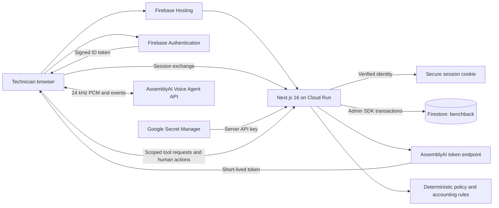

# Architecture and trust boundaries

## Runtime and identity

Firebase Hosting serves the clean public address and forwards dynamic requests to a Node.js Cloud Run service. Firebase Authentication supports email/password and anonymous guest identities. The server verifies signed tokens, checks revocation and freshness, and exchanges them for an HTTP-only `__session` cookie. Production cookies are Secure, SameSite=Lax, and expire after five days.

Password accounts need recent authentication to establish a session. Returning anonymous guests may use a freshly issued, verified token while retaining the same UID. Guest-to-email account linking keeps that UID and its workspace. Post-login redirects are normalized to local application paths.

Every private request verifies the Firebase session, including revocation. Caller-supplied identity headers are ignored. Requests through the raw Cloud Run service still need a verified cookie for private data. POST origins must match the explicit deployment allowlist; an internal proxy hostname cannot accidentally become the trusted user-facing origin. API mutations also require JSON content type and bounded, validated inputs.

## Durable persistence

The server accesses the named Firestore database `benchback` through its runtime service account. Firestore browser rules deny all direct reads and writes. Server-side tenant checks remain essential because the Admin SDK uses IAM permissions rather than browser rules.

Workspace documents use a SHA-256 identifier derived from the verified owner UID. Records, policies, events, sessions, transcripts, purchase reservations and active credit allocations live in that owner's subcollections. Quotas live outside the workspace so deletion cannot reset paid-voice limits. No persistence depends on container-local memory or files.

Each purchase snapshots its supplier policy. Later policy definitions do not rewrite historical conditions. Purchases are unique per owner by normalized supplier, invoice and line/unit reference. Multi-unit invoice lines must be split into distinct physical-unit references.

A Firestore transaction reads the current revision and commits state, audit event and credit reservation together. Action fingerprints and core IDs make identical retries idempotent and reject reused request identifiers with different meanings. Supplier/memo/line reservations prevent duplicate active credit allocation. Reversal releases the reservation while preserving the original posting and history. Credit imports validate and commit up to 200 rows atomically.

Workspace deletion holds a persisted lease. Batches of at most 200 document deletions verify that lease transactionally. After an interrupted worker, the owner can resume after two minutes; an old worker cannot release a replacement worker's lock or continue deleting after takeover. Normal mutations remain blocked during deletion.

## Accounting and permissions

Money uses integer cents. Expected deposit, recorded credit, accepted deduction and unresolved balance stay distinct. A deduction never inflates recovered credit. Reopen it before changing credits. Supplier receipt starts credit follow-up. Dispatch alone cannot establish compliance with a receipt-based deadline.

Purchase confirmation requires exact normalized part, invoice, job and purchase line. Normalization removes spaces and hyphens and changes case; it does not equate the letter O with zero. Multiple search candidates require clarification.

Voice tools may search owner records, inspect policy/readiness, record observations/inspection and add follow-up notes. A session permits edits to one selected core. Mutation transactions recheck session existence, scope, age and termination. Only human actions may confirm, prepare, dispatch, acknowledge receipt, post/reverse credits, correct dates or accept/reopen deductions. The server and domain state machine enforce these restrictions.

Browser-reported tool requests and final transcripts are not cryptographic proof of provider activity or real-world inspection. History records what the app saved, not independently verified supplier evidence. There is no image-authenticity, barcode or invoice-ingestion guarantee.

## Voice and secrets

AssemblyAI supplies the native live voice stack. Its long-lived API key stays in Secret Manager and the server runtime. The browser receives a token valid for 60 seconds; provider sessions are limited to 600 seconds. The client ends at 595 seconds and closes microphone tracks, audio nodes and sockets.

Issuance limits are eight sessions per account per UTC day and twenty globally per UTC day. A separate thirty-attempt allowance bounds repeated upstream requests. Failed issuance releases successful-session quotas. Transcripts and tools have additional per-session limits.

OpenAI is not in the production voice path. Offline video narration and synthetic technician audio used for validation may use OpenAI speech generation.

## Limits and remaining work

A workspace holds at most 3,000 core records and 100 policy definitions. CSV import allows 200 rows and 500 KB. The design is single-owner, with no shop-role sharing. There is no direct ERP, carrier, supplier, banking or payment integration. Backup restoration, monitoring coverage, production retention and support procedures still require operational validation. No customer SLA is offered.
